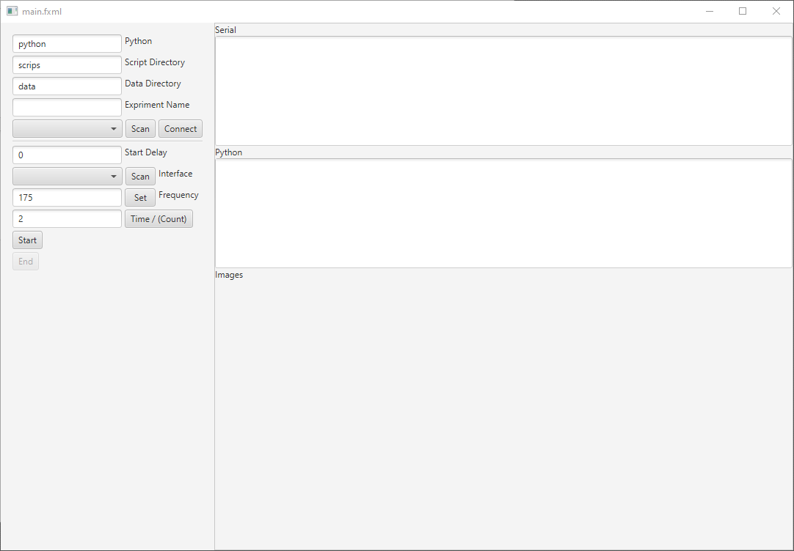

# Folder Content

### /ArduinoExperimentCollection
- Java project to communicate with Adruino, and quickly plot the results
- Build with Maven and uses JavaFX and jSerialComm
- To run in Intellij open the Maven tab and run ArduinoExperimentCollection --> Plugins --> javafx --> javafx:run
- or run ```mvn clean javafx:run```

### /ArduinoExperimentCollection/scripts
- Python scripts that get run when data has been collected via the ui

### /ArduinoExperimentCollection/sensors
- Arduino project that implements the balloon failure detection

### /ArduinoExperimentCollection/ResultsIndex.ods
- Spreadsheet that has most/all the experiment that we did and where the data is stored

### /ArduinoExperimentCollection/scripts/overview/distrib2.py
- Script to generate plots

### /Sound detection 
- Scripts for testing the filter applied to the microphone

### /CAD
- 3D Model of the blimp drone mechanism

# Overview of Failure Detection Arduino Project

## Data Structures (SensorInterface.h)

For each set of sensors there is a SensorInterface that defines:
* a unique key (char), used in communication with UI
* a recognizable name of the group of sensors, displayed in UI
* a threshold value for when the balloon failure has to be triggered
* a function to initialize the sensors
* a function to stop the sensors
* a array (and its length) of TestInfo structs for each individual sensor

The TestInfo struct contains:
* function that returns current sensor value (short)
* values to construct the activation function (on, off, off2, on2, useonoff2)
* the weight of this sensor during fusion
* the time the highest value has to be held (hold_time)
* other values that get set and updated during detection(on_time, last_value, used_last_value)

## Detection loop (Settings.h)

The main loop for detecting balloon failure is in:

```void Settings.run_times(unsigned long n)```

This function runs the detection loop n times or forever if n=0 at the frequency that has been set before (default 175 Hz). It also turns on the LED when balloon failure has been detected and triggers the blimp to drone transformation.
It used ```short TestInfo.run(unsigned long current_time)``` to get the sensor value after passing through the activation function, and apply the hold time.

## General
```sensors.ino``` sets up all the sets of sensors that can be used and communicates with the UI.
```accelerometer.h```, ```gyroscope.h```, ```piezo.h```, ```proximity_sensor.h``` and ```microphone.h``` implement function to initialize, pole and stop the sensors. ```record.h``` has helper functions for printing results, and ```transform.h``` handles the servo that controls the clutch that caused the transformation when released.

# Overview of Data Collection UI



The fist field "Python" sets the command used to execute the scripts in the directory set by "Script Directory".
The field "Data Directory" says where the results should be stored. "Experiment name" indicates how to name the folder with the results, if this field is left empty only a file with named with the current time is stored. If a Folder with the experiment name already exists "_(n)" is appended.

The dropdown box shows all serial interfaces after scanning. After connecting the next fields show up.
"Start Delay" sets a delay between pressing the start button and the start command being send.
After scanning "interface" selects which set of sensors(SensorInterface) to run.
"Frequency" sets and shows the frequency at which the sensors are checked.
"Time / Count" indicates how long to run the detection for. In "Time / (Count)" mode this value is in seconds, in "(Time) / Count" mode this value is in number of loops, in this mode if the value is set to 0 it will only stop when the stop button is pressed.

The Text Area "Serial" gets filled with the serial data the arduino sends after the it has indicated that it is done with the detection. The Text Area "Python" has the console output of the scripts, and gets all the images the scripts generate in there working directory.

## Command line arguments for scripts

Count: ```<python> <script file> <data file> -f <frequency> -c <count> -i <interface name>```

Time: ```<python> <script file> <data file> -f <frequency> -t <time> -i <interface name>```


# Plotting script

The plotting script `ArduinoExperimentCollection/scripts/overview/distrib2.py` can be used to generate plots used in the report for a specific sensor or quickly generate a plot for other data.
To generate the plots from the report run:
```
python distrib2.py MIC
python distrib2.py ACC
python distrib2.py PIEZO
python distrib2.py PROX
python distrib2.py FUSION
```
To generate other plots use:
```
python distrib.py <folder> <partial experiment name> <sensor name> <vals/max/min> ["filter"/no] [x label] [y label]
```
for example to plot the maximal values we got during our tests of fusion:
```
python distrib.py ../../pop fusion P_X max no "activation sum" "count / total"
```
This will get all the data from 'fusion', 'fusion_(1)', ..., 'fusion_(9)'.

This scrips also has some settings that can be set in the file:
```
hideHists = False      # don't display the histograms, only fit normal distributions
hideFit = True         # don't display 
dontShow = False       # don't open the graph in a window only store it
cumulative = True      # make a cumulative distribution from the histogram
showActivation = False # add the activation function
```